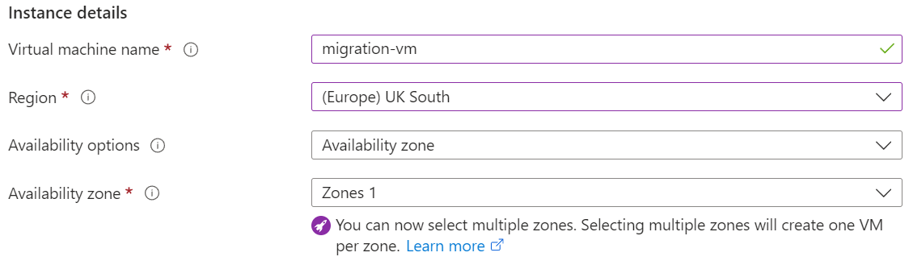
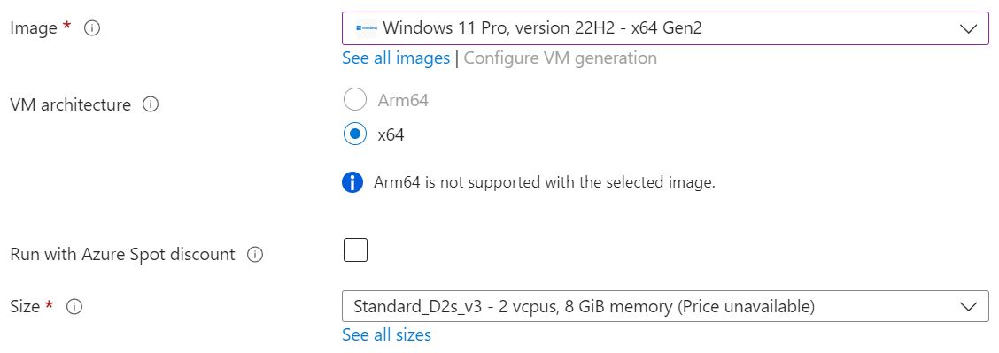
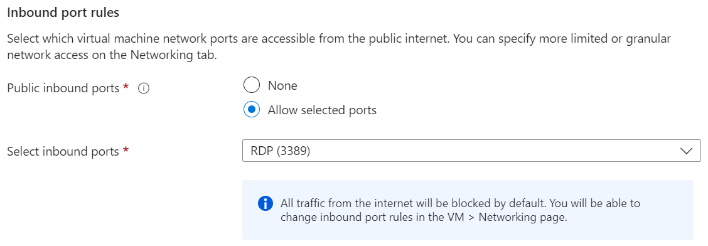
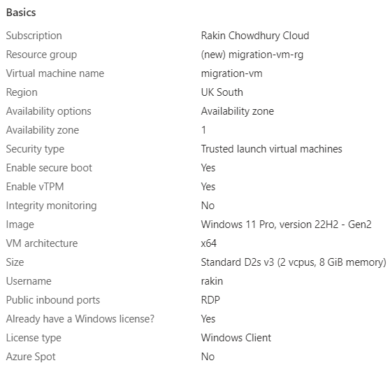
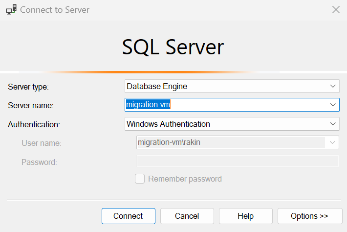
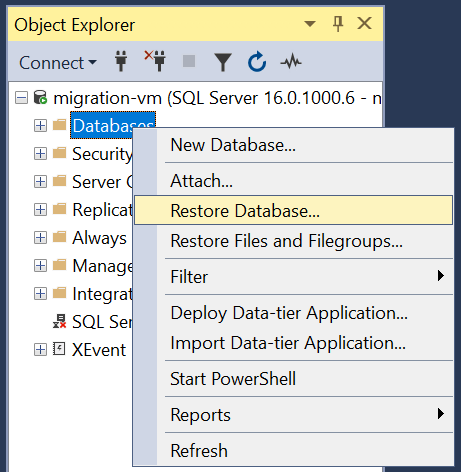
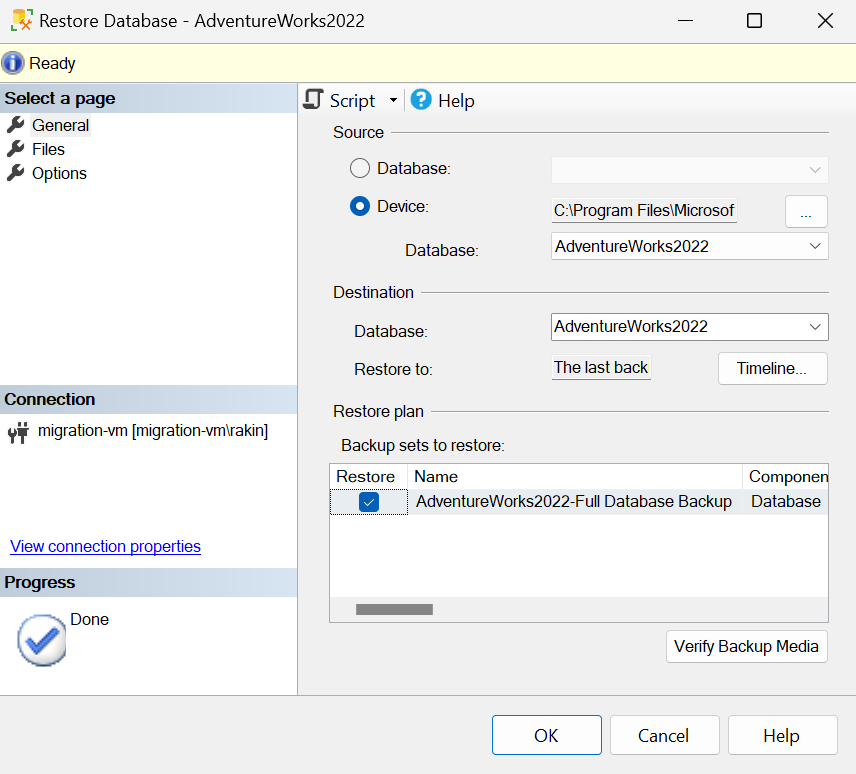
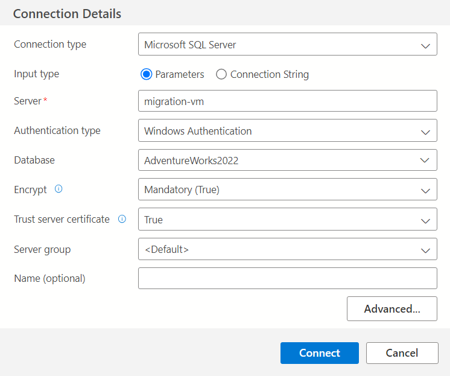

# Azure Database Migration
## Introduction
Cloud migration is the process of migrating IT resources from physical servers and computing facilities to cloud architecture. As a business or other organisation grows, it may be beneficial to transfer data from local data centres to the cloud for a variety of reasons:

- Cloud infrastructure is easily scalable to meet demands,
- Cost reduction - no need for physical infrastructure and in-house IT staff,
- Easy disaster recovery via geo-replication and failover groups,
- High reliability and uptime.

A database hosted in the cloud can offer increased flexibility and efficiency while keeping costs low.

This project aims to migrate a Microsoft SQL Server database hosted on an Azure virtual machine to an Azure SQL Database. The database will be backed up, and regularly snapshots will be saved to Azure Blob Storage to provide an additional layer of redundancy.

A crucial step is simulating a disaster recovery scenario, where critical data is lost or corrupted and the database needs to be restored from a backup. This is to ensure data can be recovered in the event of unintended destruction or alteration.

To supplement this, geo-replication will be implemented as an additional safety net and to ensure availability when the database is undergoing planned maintenance or unexpected conditions. Microsoft Entra ID will be integrated to define access roles, adding extra control and protection.

This project is part of the AiCore Cloud Engineering Pathway.

Tools used: Microsoft Azure (VMs, SQL Database, Blob Storage, Database Migration Service), Microsoft SQL Server, SQL Server Management Studio, Azure Data Studio, Microsoft Entra ID.

## Steps Taken
1. [Production Environment Setup](#1-production-environment-setup)
    - [Virtual Machine Setup](#virtual-machine-setup)
    - [Creating the Production Database](#creating-the-production-database)
2. [Migration to Azure SQL Database](#2-migration-to-azure-sql-database)
3. [Data Backup and Restoration](#3-data-backup-and-restoration)
4. [Disaster Recovery Simulation](#4-disaster-recovery-simulation)
5. [Geo-Replication and Failover](#5-geo-replication-and-failover)
6. [Microsoft Entra ID Integration](#6-microsoft-entra-id-integration)

### 1. Production Environment Setup
In order to migrate a database to the cloud, there needs to be a source database from which to transfer the data. The first step in this project is to provision a Windows virtual machine (VM) on Azure which will act as the production environment.

#### Virtual Machine Setup
The virtual machine was created in UK South availability zone 1, with a Windows 11 Pro image using the Standard D2s v3 size. This was determined to be a suitable size for the workload to be carried out, while UK South is the closest available region geographically.

A Windows VM is required in order to simulate an organisation's on-premise Windows server where data would be stored.

Crucially, the "public inbound ports" rule should be set to "allow selected ports", and "RDP (3389)" should be chosen for "select inbound ports". This is to ensure the VM can be connected to from the local machine via a Remote Desktop Protocol (RDP).

Below is a basic summary of the settings used to create the VM where the database was hosted.

To connect to the VM via RDP, a `.rdp` file can be downloaded from the connect page of the VM on Azure. A username and password for the machine should have been set up during the VM's creation. When running the file a prompt will ask for these login details, which after being entered correctly will facilitate a connection to the VM.

---

#### Creating the Production Database
Firstly, [Microsoft SQL Server](https://www.microsoft.com/en-GB/sql-server/sql-server-downloads) and [SQL Server Management Studio (SMSS)](https://learn.microsoft.com/en-us/sql/ssms/download-sql-server-management-studio-ssms?view=sql-server-ver16) must be downloaded and installed on the virtual machine. If not included in the SMSS download, [Azure Data Studio](https://learn.microsoft.com/en-us/azure-data-studio/download-azure-data-studio?tabs=win-install%2Cwin-user-install%2Credhat-install%2Cwindows-uninstall%2Credhat-uninstall) must also be installed in order to complete the migration step.

The database that was used to replicate an authentic production environment was AdventureWorks, a sample database containing data regarding a fictional company's operations. The [`AdventureWorks2022.bak`](https://learn.microsoft.com/en-us/azure-data-studio/download-azure-data-studio?tabs=win-install%2Cwin-user-install%2Credhat-install%2Cwindows-uninstall%2Credhat-uninstall) file must be downloaded on the virtual machine, which is a backup file that will be used to restore the database on the VM.

As shown above, when launching SSMS, a popup will open prompting a connection to a server. The fields may already be filled out for connection to the server on the VM. If not, the server name should be the VM name. Selecting Windows Authentication as the authentication method is suitable in this instance since remote access to this server is not required.

In order to restore AdventureWorks on the machine, the `AdventureWorks2022.bak` file previously downloaded on the VM must be moved or copied to `C:\Program Files\Microsoft SQL Server\MSSQL16.MSSQLSERVER\MSSQL\Backup`. On SMSS, an object explorer window should be visible, showing the SQL Server instance and any objects related to it. Right clocking on the **Databases** node will allow a database to be restored.

Restoring a database from a source backup file saved on the device can be done by navigating to the backup folder given above. The **Restore Database** window is shown below.

AdventureWorks should be now be set up on the VM as the simulated production database.

### 2. Migration to Azure SQL Database
[Microsoft Integration Runtime](https://www.microsoft.com/en-us/download/details.aspx?id=39717)

### 3. Data Backup and Restoration

### 4. Disaster Recovery Simulation

### 5. Geo-Replication and Failover

### 6. Microsoft Entra ID Integration
