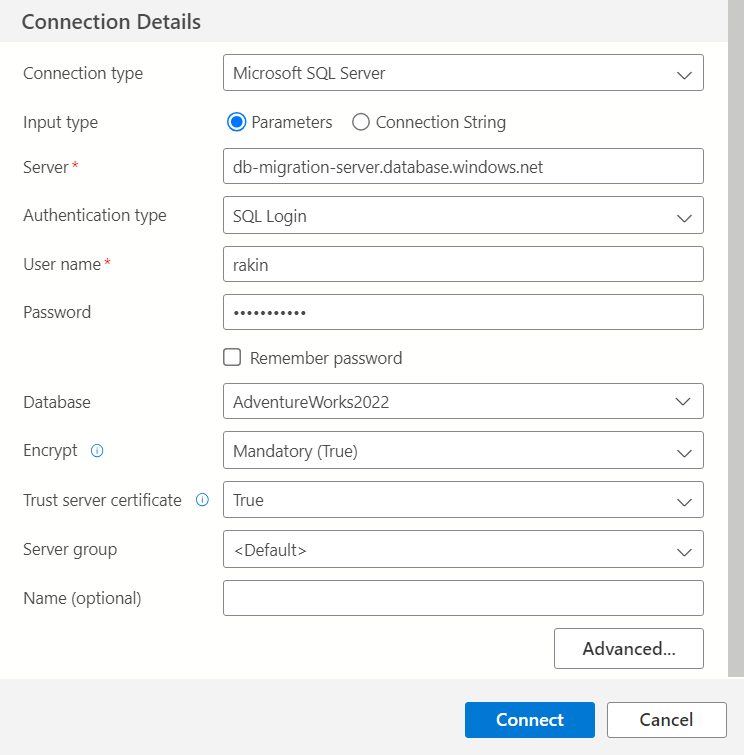
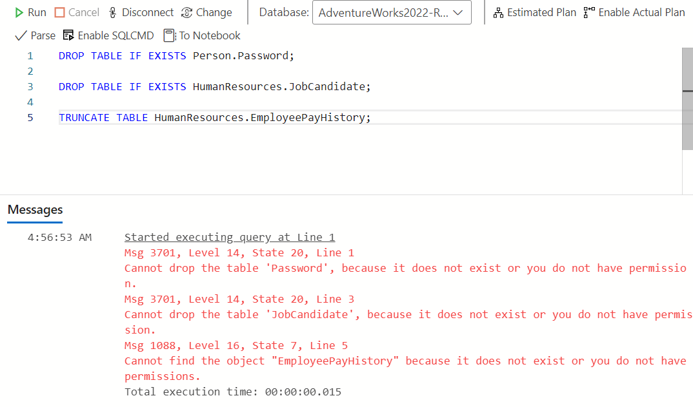

# Azure Database Migration
## Introduction
Cloud migration is the process of migrating IT resources from physical servers and computing facilities to cloud architecture. As a business or other organisation grows, it may be beneficial to transfer data from local data centres to the cloud for a variety of reasons:

- Cloud infrastructure is easily scalable to meet demands,
- Cost reduction - no need for physical infrastructure and in-house IT staff,
- Easy disaster recovery via geo-replication and failover groups,
- High reliability and uptime.

A database hosted in the cloud can offer increased flexibility and efficiency while keeping costs low.

This project aims to migrate a Microsoft SQL Server database hosted on an Azure virtual machine to an Azure SQL Database. The database will be backed up, and regularly snapshots will be saved to Azure Blob Storage to provide an additional layer of redundancy.

A crucial step is simulating a disaster recovery scenario, where critical data is lost or corrupted and the database needs to be restored from a backup. This is to ensure data can be recovered in the event of unintended destruction or alteration.

To supplement this, geo-replication will be implemented as an additional safety net and to ensure availability when the database is undergoing planned maintenance or unexpected conditions. Microsoft Entra ID will be integrated to define access roles, adding extra control and protection.

This project is part of the AiCore Cloud Engineering Bootcamp.

Tools used: Microsoft Azure (VMs, SQL Database, Blob Storage, Database Migration Service), Microsoft SQL Server, SQL Server Management Studio, Azure Data Studio, Microsoft Entra ID.

## Project Architecture


Above is the UML diagram for the architecture of the project, showing how each resource and part of the project is related to the others.

## Steps Taken
1. [Production Environment Setup](#1-production-environment-setup)
    - [Virtual Machine Setup](#virtual-machine-setup)
    - [Creating the Production Database](#creating-the-production-database)
2. [Migration to Azure SQL Database](#2-migration-to-azure-sql-database)
    - [Azure SQL Database Setup](#azure-sql-database-setup)
    - [Schema Migration](#schema-migration)
    - [Data Migration](#data-migration)
3. [Data Backup and Restoration](#3-data-backup-and-restoration)
    - [Database Backup to Blob Storage](#database-backup-to-blob-storage)
    - [Database Restoration to Development VM](#database-restoration-to-development-vm)
    - [Backup Automation](#backup-automation)
4. [Disaster Recovery Simulation](#4-disaster-recovery-simulation)
5. [Geo-Replication and Failover](#5-geo-replication-and-failover)
    - [Geo-Replication](#geo-replication)
    - [Failover and Failback](#failover-and-failback)
6. [Microsoft Entra ID Integration](#6-microsoft-entra-id-integration)

---

### 1. Production Environment Setup
In order to migrate a database to the cloud, there needs to be a source database from which to transfer the data. The first step in this project is to provision a Windows virtual machine (VM) on Azure which will act as the production environment.

#### Virtual Machine Setup
The virtual machine was created in UK South availability zone 1, with a **Windows 11 Pro** image using the **Standard D2s v3** size. This was determined to be a suitable size for the workload to be carried out, while UK South is the closest available region geographically.


A Windows VM is required in order to simulate an organisation's on-premise Windows server where data would be stored.

Crucially, the "public inbound ports" rule should be set to "allow selected ports", and "RDP (3389)" should be chosen for "select inbound ports". This is to ensure the VM can be connected to from the local machine via a Remote Desktop Protocol (RDP).


Below is a basic summary of the settings used to create the VM where the database was hosted.


To connect to the VM via RDP, a `.rdp` file can be downloaded from the connect page of the VM on Azure. A username and password for the machine should have been set up during the VM's creation. When running the file a prompt will ask for these login details, which after being entered correctly will facilitate a connection to the VM.

---

#### Creating the Production Database
Firstly, [Microsoft SQL Server](https://www.microsoft.com/en-GB/sql-server/sql-server-downloads) and [SQL Server Management Studio (SMSS)](https://learn.microsoft.com/en-us/sql/ssms/download-sql-server-management-studio-ssms?view=sql-server-ver16) must be downloaded and installed on the virtual machine. If not included in the SMSS download, [Azure Data Studio](https://learn.microsoft.com/en-us/azure-data-studio/download-azure-data-studio?tabs=win-install%2Cwin-user-install%2Credhat-install%2Cwindows-uninstall%2Credhat-uninstall) must also be installed in order to complete the migration step.

The database that was used to replicate an authentic production environment was AdventureWorks, a sample database containing data regarding a fictional company's operations. The [`AdventureWorks2022.bak`](https://learn.microsoft.com/en-us/azure-data-studio/download-azure-data-studio?tabs=win-install%2Cwin-user-install%2Credhat-install%2Cwindows-uninstall%2Credhat-uninstall) file must be downloaded on the virtual machine, which is a backup file that will be used to restore the database on the VM.


As shown above, when launching SSMS, a popup will open prompting a connection to a server. The fields may already be filled out for connection to the server on the VM. If not, the server name should be the VM name. Selecting Windows Authentication as the authentication method is suitable in this instance since remote access to this server is not required.

In order to restore AdventureWorks on the machine, the `AdventureWorks2022.bak` file previously downloaded on the VM must be moved or copied to `C:\Program Files\Microsoft SQL Server\MSSQL16.MSSQLSERVER\MSSQL\Backup`. On SMSS, an object explorer window should be visible, showing the SQL Server instance and any objects related to it. Right clocking on the **Databases** node will allow a database to be restored.


Restoring a database from a source backup file saved on the device can be done by navigating to the backup folder given above. The **Restore Database** window is shown below.


AdventureWorks should be now be set up on the VM as the simulated production database.

---

### 2. Migration to Azure SQL Database

The migration step involves creating an Azure SQL Database, and using Azure Data Studio and various extensions, as well as Microsoft Integration Runtime to migrate the database schema then the data.

#### Azure SQL Database Setup
The project made use of a database created in a server in the UK South region, with the "Compute + storage" option set to **General Purpose - Serverless**. This was seen as a suitable level of storage for the workload. The basic settings used to create the database are shown below.


If a server for the database does not already exist, one must be created. The authentication method is set when creating a server. For this project, SQL authentication was used, which establishes a server admin user name and password in order to connect to the server.

It is essential that the firewall rules for the database are configured correctly. This will allow connection to the database from the virtual machine. After the database has been created, in the **Firewall rules** section of the **Networking** page, new firewall rules can be added. The rule should be given a name and the VM public IP address (which can be found on the VM Overview page) should be pasted into the **Start IPv4 address** and **End IPv4 address** fields.


Azure Data Studio is required to perform a database migration, which should already be installed as per the instructions [above](#creating-the-production-database).

From the Azure Data Studio home screen, connections can be made both to the local database as well as to the Azure SQL database by clicking on the **Create a connection** button.


To connect to the Azure database, on the **Connection Details** window the server should be the name of the server on which the database is hosted. This can be found by navigating to the overview page for the database on Azure. Inputting the SQL login details, selecting the database, and setting "trust server certificate" to true will allow a connection to be established.

Connection to the local database can be done with Windows authentication.



---

#### Schema Migration
After connections to both the source and target databases are established, the **SQL Server Schema Compare** extension will need to be installed within Azure Data Studio. This can be found via the extensions tab on the sidebar.


Once installed, database schemas can be compared by right clicking on the local server and selecting **Schema Compare**. This leads to a comparison screen where the source (local database) and the target (Azure database) can be selected. Upon clicking **Compare**, specific schema changes can be applied. In this case, all changes were included, most of them being adding tables. Clicking apply will synchronise the schema between the two databases.

When this is complete, the new schema should be visible in the object explorer after refreshing the **Tables** node.


---

#### Data Migration
After the schema has been migrated, the data must also be migrated. This requires installing the **Azure SQL Migration** extension on Azure Data Studio, also found in the extensions tab.


On the local server management page (found by right clicking on the server and clicking **Manage**) a migration can be started by navigating to the **Azure SQL Migration** tab and clicking on **Migrate to Azure SQL** as shown below.


This will open up the migration wizard:

- **Step 1:** Select the database to be assessed for migration to Azure SQL.
    
- **Step 2:** This step will assess the chosen database(s) to identify a suitable Azure SQL target.

- **Step 3:** In this step the target database type can be chosen. *Azure SQL Database* should be selected in this instance.

- **Step 4:** Select the Azure account and target database. If an Azure account is not already linked, it can be added by logging in through the browser.

- **Step 5:** For this step, an *Azure Database Migration Service* will need to be created. This can be done on the Azure portal. Select the appropriate source and target server types, and select *Database Migration Service*. The migration service must be located in the same region as the other services, in this case it was UK South.


- **Step 6:** In order to continue [Microsoft Integration Runtime](https://www.microsoft.com/en-us/download/details.aspx?id=39717) must be installed to register the Database Migration Service and facilitate a connection between the two databases. Instructions for this are given in the migration wizard. After installing the integration runtime, it can be registered by using one of the two keys provided in Azure Data Studio and clicking *Register*.


- **Step 7:** This step involves providing the login credentials for the virtual machine, which are used to log in to the database server. After this, the tables to be migrated can be selected. For this project, all tables were selected for migration. Once this is complete, *Run validation* will ensure that the migration settings are correct, and that the integration runtime as well as both databases can be connected to without error.


- **Step 8:** If validation is successful, begin migrating the database.

Once migration is complete, the data can be checked using the pre-established connection to the Azure database on Azure Data Studio.

At this point the database migration is complete!

---

### 3. Data Backup and Restoration
The database should be backed up in the event that the data needs to be restored to a previous state. This could be due to data loss or corruption, or other unforeseen issues.

#### Database Backup to Blob Storage
The **Back Up Database** window can be found by right clicking on the database in the object explorer then navigating to **Tasks -> Back Up...** in the right click menu. Here the source, backup type, and destination for the file can be chosen. For this project, a full backup was created. The destination folder was set as `C:\Program Files\Microsoft SQL Server\MSSQL16.MSSQLSERVER\MSSQL\Backup`, the same folder from which the database was restored.


The next step is to upload this backup file to an Azure Blob Storage account, which provides an additional layer of safety and redundancy. Creating a Storage account can be done from the Azure portal, making sure that it is located in UK South. The basic settings for the account are shown below.


Once this is created, a container can be created within the account and the backup file created earlier can be uploaded to create a copy in the cloud.

---

#### Database Restoration to Development VM
Creating a development environment for data allows testing and experimentation on the database without affecting live data in the production database and anything that might rely on it.

A development database was created inside another virtual machine, using the exact same setting as the ones used to create the production VM [above](#virtual-machine-setup). The same [process](#creating-the-production-database) of installing SQL Server, SMSS, and Azure Data Studio should be followed.

Downloading the backup file previously uploaded to Azure Blob Storage on the virtual machine will allow the database to be restored from it. This file must be moved or copied to `C:\Program Files\Microsoft SQL Server\MSSQL16.MSSQLSERVER\MSSQL\Backup` as was done to create the production database. By right clicking the **Databases** node in the object explorer, the **Restore Database** window will allow restoration from the backup file.


---

#### Backup Automation
Creating regular backups helps to restore the database to the latest version, protecting recent changes and allowing for easy and efficient data recovery. This can be done by creating a Maintanence Plan in SMSS.

Firstly, an SQL Server Credential must be created in order to allow SQL Server to access the Blob Storage. The following T-SQL query can be executed by right clicking on the server name in SMSS and clicking **New Query**:

```sql
CREATE CREDENTIAL [CredentialName]
WITH IDENTITY = '[Azure Storage Account Name]',
SECRET = 'Access Key';  
```

`CredentialName` should be replaced with a descriptive name for the credential (**"rakinstorage_credentials"** was used for this project), and `Azure Storage Acount Name` should be replaced with the name of the Storage Account (in this case **"rakinstorage"**).

The `Access Key` can be found on the Storage Account resource in Azure by navigating to the **Security + networking -> Access keys** page. One of these access keys should be used when executing the above query.


After this query is executed, the credential should be visible in the object explorer under the **Security -> Credentials** node.

In order to create a Maintenance Plan, the SQL Server Agent must first be started by right clicking its node in the object explorer and clicking **Start**. Then, right clicking on **Maintanence Plans** (under the **Management** node) and selecting **Maintanence Plan Wizard** will allow backups to be scheduled.

In the **Maintanence Plan Wizard** a name for the plan, and a schedule, can be chosen. For this project, the plan (**"WeeklyBackup"**) was scheduled to be performed every Wednesday at midnight, without an end date, starting from the 3rd of January.


**Back Up Database (Full)** should be selected, and in the next window the database and destination can be chosen. Under the **Destination** tab the correct SQL credential should be chosen, and the Azure storage container and URL prefix can be found on the container resource page on Azure.


After the Maaintanence Plan has successfully been created, it can be verified by checking the Storage Account to see if the backup file has been uploaded correctly.

---

### 4. Disaster Recovery Simulation
Intentionally mimicking an event causing data loss/corruption will give firsthand experience in the procedure used to recover this data.

The first step is to remove critical data from the production database to simulate a scenario where data is compromised. For this project, the following SQL queries were executed:

```sql
DROP TABLE IF EXISTS Person.Password;

DROP TABLE IF EXISTS HumanResources.JobCandidate;

TRUNCATE TABLE HumanResources.EmployeePayHistory;
```

These queries deleted two tables and removed all the data from the third.

The recovery process involves using an Azure SQL Database Backup. This is done by navigating to the database resource page on Azure and clicking **Restore**. From here, the database can be restored from a source database, which requires selecting a point in time to restore from. This should be the latest time before the data loss occurred in order to minimise loss of up-to-date production data, however in this case since it is not an active database, a the restore point was chosen as a approximately a day before the data loss event. A new database name can then be chosen.


The newly restored database should be examined to ensure that the previously deleted data is accessible again. For this project, the `Person.Password`, `HumanResources.JobCandidate`, and `HumanResource.EmployeePayHistory` tables were all found and contained all the correct data.

---

### 5. Geo-Replication and Failover
Geo-replication creates a synchronised copy of the database in a different geographical region, which ensures that downtime is minimised in the event of planned maintanence or unforeseen cirumstances.

#### Geo-Replication
A geo-replica of the desired production database on Azure can be created by navigating to the database resource page and selecting the **Replicas** page. After clicking on **Create replica**, a new server will have to be provisionsed. This server should be located in a region geographically distant to the first in order to ensure redundancy. For this project, the database was named **db-migration-server-2** in **East US**.


After this is created, Azure will synchronise data between the two databases.

---

#### Failover and Failback
A failover involves switching the workload from the primary database to a secondary geo-replica of the database in the event of maintanence or disaster.

In order to execute a failover, a failover group must first be created. One can be made on the Azure page of the server of the primary database, by navigating to the **Failover groups** page on the sidebar and clicking **Add group**. During setup a group name should be entered and the **Server** chosen should be the secondary server.

Once this is complete, navigating to the failover group resource page should show the map below.


To initiate a failover, the **Failover** button can be clicked. This will come up with a warning about switching the secondary database to the primary role, to which **Yes** should be selected.

After this is completed, the page should show that the second server is now the primary, and the first is now the secondary.


Clicking **Failover** again will perform a failback, and restore the servers to their original roles.


---

### 6. Microsoft Entra ID Integration
Integrating Microsoft Entra ID into Azure SQL database allows refined control over who can access the data. This enhances security and prevents unauthorised data access or manipulation. For this project, a database reader account was created, giving read-only access to the database.

First, the Microsoft Entra Admin must be set by navigating to the **Microsoft Entra** page of the primary server resource on Azure and clicking **Set admin**. From here, the admin user can be selected. This should be tested by connecting to the server in Azure Data Studio using the **Microsoft Entra ID** authentication type.

A database reader can be created by going to the **Microsoft Entra ID** page on Azure and clicking on **New user -> Create new user**. At this point, the user name and password can be set. In this instance the user name was set as **"Rakin_DB_reader"**.


After this is done, the following SQL query should be executed in Azure Data Studio, making sure that the server is connected to using Microsoft Entra ID authentication:

```sql
CREATE USER [DB_Reader@domain.com] FROM EXTERNAL PROVIDER;
ALTER ROLE db_datareader ADD MEMBER [DB_Reader@domain.com];
```

The account name in brackets should be replaced with the user principal name that has just been created.


This should be verified by logging into the server using the Microsoft Entra ID login details of the database reader user. This account should be able to view all the data in the database, but an error should be returned if there is an attempt to alter any data, as shown below.



Once this is done the project is complete.

---